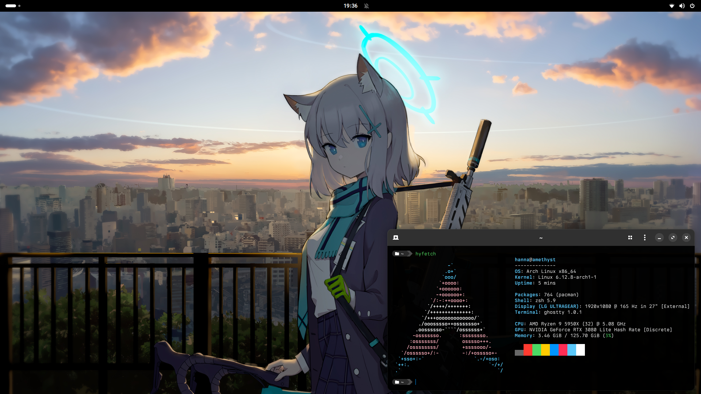

# Dotfiles 

This repository contains the configuration files for my Arch Linux setup.

## Software and Themes

If you want you can check out the [themes](THEMES.md) I use and [software](SOFTWARE.md).

## Screenshot

